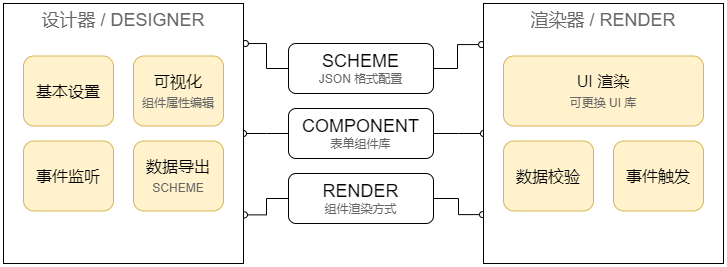

<div align=center>
<h1> 栅栏（格子）表单 / GRID-FORM </h1>


</div>

基于 GRID 布局的简单表单工具（包含可视化设计器、渲染器），默认组件库为 [Naive UI](https://www.naiveui.com)。

此工具仅适用于布局简单纯粹的表单场景 😄

包名|说明|进度|版本
-|-|-|-
common|通用工具|✅|
designer|可视化设计器（基于 Naive UI）|✅|
render-naive|基于[Naive UI](https://www.naiveui.com)实现的渲染器|✅|
render-element|基于[Element Plus](https://element-plus.org/zh-CN/)实现的渲染器|✅|
render-vant|基于[Vant4](https://vant-ui.github.io)实现的渲染器|✅|


**相关博文**

* [基于 VUE3 可视化低代码表单设计器](https://blog.csdn.net/ssrc0604hx/article/details/128825163)
* [嵌套子表单与自定义脚本交互](https://blog.csdn.net/ssrc0604hx/article/details/135828101)


## 1. 总览 / OVERVIEW



更多截图请看 [screenshot](docs/screenshot)

## 2. 开始使用 / GETTING STARTED

### 2.1 仅使用渲染器

1. 安装依赖

```shell
npm i -S @grid-form/render-naive
```

2. 使用渲染器组件

```html
<FormRender :renders="RenderFuncs" :form="form" debug
    @submit="onSubmit" @failed="onFailed" />
```

```javascript
import { FormRender, RenderFuncs } from "@grid-form/render-naive"

// 如需扩展 RenderFuncs 请自行扩写
// 表单对象通常来自后端，详细数据结构请查看 packages/example/src/views/渲染器.vue
let form = reactive({})
```

**Props**

名称|类型|默认值|说明
-|-|-|-
renders|Object|{}|组件渲染函数
gridGap|Number|10|可视化区域栅栏间隔，单位 px
form|Object|undefined|表单对象
review|Boolean|false|是否在提交前对表单项做校验
debug|Boolean|false|开启debug 模式后，会在控制台输入各种信息
placeholder|String|`^\\${(.*)}$`|默认值占位符检测正则表达式
valueProvider|Object|{}|占位符内容计算函数，详见下一节的说明
on-inited|()=>void|undefined|
on-submit|(formObj:Object,action="post")=>void|undefined|用户点击提交按钮后触发（如设置了 `review` 则自检成功后方触发）
on-failed|(fails:Array[String])=>void|undefined|设置`review`后自检失败触发

#### 2.1.1 表单项默认值
> 我们可以通过`${xxxx}`的格式设置（注意，前后不能有其他字符）表单项的默认值，渲染过程中会将占位符替换为计算后的值

```javascript
//默认使用的计算函数
import { formValueProvider } from "@grid-form/common"

import dayjs from 'dayjs'

/*
扩展默认的表单默认值计算器
支持 Promise （未作异常捕获，慎用）
*/
formValueProvider["${date}"]        = ()=> dayjs(new Date()).format("YYYY-MM-DD")
formValueProvider["${username}"]    = ()=> "集成显卡"

//详见 packages\example\src\views\渲染器.vue
```

#### 2.1.2 内置组件
> 业务系统可自行扩展自定义组件

组件名称|说明|Naive UI|Element Plus|Vant4
-|-|-|-|-
文本输入|支持TEXTAREA|✅|✅|✅
数值输入|仅限数字|✅|✅|✅
动态标签|标签组输入（Array）|✅|✅|
`按钮`|可用于交互操作|✅|✅|✅
日期选择||✅|✅|✅
下拉选择（Select）|支持多选|✅|✅|✅
单选框（Radio）||✅|✅|✅
开关（Switch）|布尔值|✅|✅|✅
多选框（Checkbox）||✅|✅|✅
星级评分（Rate）|数值|✅|✅|✅
颜色选择器||✅|✅|
文件上传|按指定格式读取内容|✅|✅|✅
静态文本|支持HTML|✅|✅|✅
信息框|标题+正文，支持HTML|✅|✅|✅
分割线||✅|✅|✅
`图片展示`||✅|✅|✅
静态表格|简单的二维数据展示表格|✅|✅|✅
子容器（Card）|嵌套容器|✅|✅|✅

注意：上述组件`特殊标注`则表示支持自定义脚本

### 2.2 使用设计器
> 设计器依赖 render-naive

```shell
npm i -S @grid-form/designer @grid-form/render-naive
```

```html
<Designer :renders="RenderFuncs" :components="Components" :form="form" 
    debug show-footer style="height: 100%;" />
```

```javascript
import { reactive } from 'vue'
import { Designer, Components } from "@grid-form/designer"
import { RenderFuncs } from "@grid-form/render-naive"
import { createForm } from "@grid-form/common"

// 如需扩展 RenderFuncs、Components ，请自行扩写
let form = reactive(createForm())
```

**Props**

名称|类型|默认值|说明
-|-|-|-
components|Array|[]|组件库
renders|Object|{}|组件渲染函数
siderWidth|Number,String|360|左右侧边栏的宽度，支持 px、% 单位，建议直接传递数值
gridGap|Number|10|可视化区域栅栏间隔，单位 px
review|Boolean|false|是否对表单项做校验（如id、名称不能为空，不允许重复 id），校验不通过则抛出异常
form|Object|undefined|表单对象
compact|Boolean|false|紧凑的布局，如果设置为true，则左右两侧的属性编辑行距缩短
headerHeight|Number|55|设计器头部高度
showFooter|Boolean|false|是否显示设计器底部
footerHeight|Number|50|设计器底部高度，单位 px
contextMenu|Boolean|false|`SINCE 0.0.6`是否启用右键菜单（方便操控表单项）
enableCtrlS|Boolean|false|`SINCE 0.0.8`是否启用 CTRL+S 保存快捷键
debug|Boolean|false|开启debug 模式后，会在控制台输入各种信息

**Slots**

名称|说明
-|-
title|设计器头部标题内容
footer|设计器底部内容（需要设置 `show-footer` 为 true）

效果如下


## 3. 数据结构 / DATA STRUCTURE

### 3.1 表单

属性|类型|默认值|说明
-|-|-|-
id|String|undefined|表单ID（由业务系统自行填充）
size|String|medium|整体表单尺寸，其他值：`small`、`large`
width|String,Number|100%|表单宽度（支持 px、% 格式）
grid|Number|3|栅栏格数（1 到 24 之间）
labelWidth|Number|120|标签宽度（单位 px）
labelShow|Boolean|true|全局设置标签是否显示
labelPlacement|String|top|标签位置，其他值：`left`（左边），`Vant`渲染器不适用
labelAlign|String|left|标签对齐方式，其他值：`right`（靠右）
submitText|String|提交数据|默认按钮的文本（若为空，则不显示该按钮）
okText|String||提交完成后回显文案（由业务系统进行回显）
url|String||后端接口地址（由业务系统完成数据提交）
onLoad|String|undefined|`JS 代码`表单初始化后调用
onSubmit|String|undefined|`JS 代码`表单提交前调用钩子，用于进行数据预处理，也可以中断表单（返回 Promise）
onChange|String|undefined|`JS 代码`表单值变动时调用钩子，通常用于表单联动（`since v0.0.4`）
afterSubmit|String|undefined|`JS 代码`表单提交完成后调用钩子（注意：需要由业务系统自行调用）
hides|Array|[]|表单默认值（隐藏项），包含`id`、`value`两个属性
items|Array|[]|表单项
buttons|Array|[]|自定义按钮

### 3.2 表单项
> 表单项属性分两类：控件属性、基本信息（以`_`开头），分别对应了组件渲染函数的两个参数：`props`、`attrs`

属性|类型|默认值|说明
-|-|-|-
_uuid|String||表单项ID（对于显示类组件不存在该属性）
_text|String||标签内容
_widget|String||组件编号（按此定位渲染函数）
_col|Number|1|组件所占格子数
_value|String||默认值（支持占位符）
_required|Boolean|false|是否必填
_regex|String||检验正则表达式
_message|String||校验不通过时回显的文字

### 3.3 额外按钮

属性|类型|默认值|说明
-|-|-|-
text|String|按钮|文本信息
theme|String|default|按钮配色，其他值：`success`（绿色）、`warning`（橙色）、`error`（红色）
type|String|post|触发事件类型，`post`（与`默认按钮`一致，表单提交）、`download`（下载操作）、`script`（仅执行代码）
code|String|undefined|若脚本返回`false`则中断后续流程


## 4. 开发 / DEVELOPMENT
> 本项目采用 `pnpm` 进行管理，请确保相应环境已安装

```shell
# 拉取最新代码
git clone https://github.com/0604hx/grid-form

# 安装依赖
pnpm i

# 运行示例
pnpm dev

# 执行成功后，浏览器访问 http://localhost:8080 即可访问首页
# 即可体验可视化设计器以及各个组件库对应的渲染效果
```

### 4.1 更新日志

详见：[changelog.md](docs/changelog.md)

## 5. 附录 / ABOUT

### 5.1 说明

1. 此组件仅为个人学习
2. LOGO 来自[阿里巴巴矢量图标库](https://www.iconfont.cn/)

### 5.2 主流选型
> 这里列出可二次开发的, 同时具备表单渲染、表单设计的工具（截止至 2022年底）

方案 | 框架 | UI库 | 备注
---------|----------|---------|---------
[formilyjs](https://formilyjs.org)|React、Vue|AntD、Element、Vant等主流|`校验`、`事件交互`阿里巴巴开源的表单设计工具体系，能做到一份表单设计多端适配；但是对 **vue3** 支持不完备（设计器得自己做）
[FormMaking](https://form.making.link/#/zh-CN/)|VUE|AntD、Element|`校验`、`事件交互`操作良好，需要高级版本才支持 **vue3**
[form-generator](https://github.com/JakHuang/form-generator)|VUE|Element|`校验` 操作良好，预览不友好（不够直接爽快），目前不支持**vue3**
[form-create](http://form-create.com/v3/guide/)|VUE|iView、AntD、Element、Naive UI|`校验`操作良好，支持多个 UI 框架，对 **vue 2/3** 均支持，无设计器
[VForm](https://www.vform666.com/document3.html)|VUE|Element|`校验`、`事件交互` 操作良好，开源版不支持**数据源**、**子表单**

