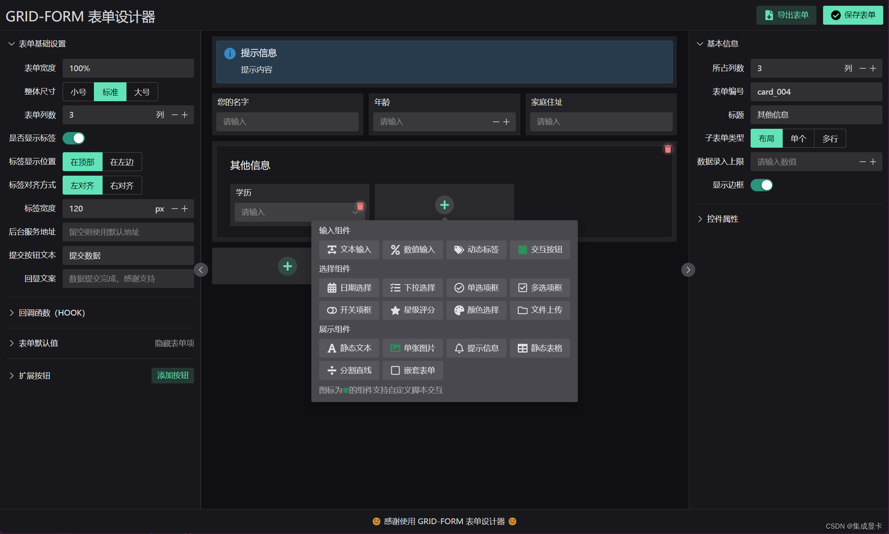

<div align=center>
<h1>   栅栏（格子）表单 / GRID-FORM </h1>


</div>

基于 GRID 布局的简单表单工具（包含可视化设计器、渲染器），默认组件库为 [Naive UI](https://www.naiveui.com)。

此工具仅适用于布局简单纯粹、无嵌套的表单场景 😄

包名|说明|进度
-|-|-
common|通用工具|✅
designer|可视化设计器（基于 Naive UI）|✅
render-naive|基于[Naive UI](https://www.naiveui.com)实现的渲染器|✅
render-element|基于[Element Plus](https://element-plus.org/zh-CN/)实现的渲染器|
render-vant|基于[Vant4](https://vant-ui.github.io)实现的渲染器|✅

## 总览 / OVERVIEW


更多截图请看 [screenshot](docs/screenshot)

## 开始使用 / GETTING STARTED

### 仅使用渲染器

1. 安装依赖

```shell
npm i -S @grid-form/render-naive
```

2. 使用渲染器组件

```html
<FormRender :renders="RenderFuncs" :form="form" debug
    @submit="onSubmit" @failed="onFailed" />
```

```javascript
import { FormRender, RenderFuncs } from "@grid-form/render-naive"

// 如需扩展 RenderFuncs 请自行扩写
// 表单对象通常来自后端，详细数据结构请查看 packages/example/src/views/渲染器.vue
let form = reactive({})
```

**Props**

名称|类型|默认值|说明
-|-|-|-
renders|Object|{}|组件渲染函数
gridGap|Number|10|可视化区域栅栏间隔，单位 px
form|Object|undefined|表单对象
review|Boolean|false|是否在提交前对表单项做校验
debug|Boolean|false|开启debug 模式后，会在控制台输入各种信息
placeholder|String|`^\\${(.*)}$`|默认值占位符检测正则表达式
valueProvider|Object|{}|占位符内容计算函数，详见下一节的说明
on-inited|()=>void|undefined|
on-submit|(formObj:Object,action="post")=>void|undefined|用户点击提交按钮后触发（如设置了 `review` 则自检成功后方触发）
on-failed|(fails:Array[String])=>void|undefined|设置`review`后自检失败触发

#### 表单项默认值
> 我们可以通过`${xxxx}`的格式设置（注意，前后不能有其他字符）表单项的默认值，渲染过程中会将占位符替换为计算后的值

```javascript
//默认使用的计算函数
import { formValueProvider } from "@grid-form/common"

import dayjs from 'dayjs'

/*
扩展默认的表单默认值计算器
支持 Promise （未作异常捕获，慎用）
*/
formValueProvider["${date}"]        = ()=> dayjs(new Date()).format("YYYY-MM-DD")
formValueProvider["${username}"]    = ()=> "集成显卡"

//详见 packages\example\src\views\渲染器.vue
```

### 使用设计器
> 设计器依赖 render-naive

```shell
npm i -S @grid-form/designer @grid-form/render-naive
```

```html
<Designer :renders="RenderFuncs" :components="Components" :form="form" 
    debug show-footer style="height: 100%;" />
```

```javascript
import { reactive } from 'vue'
import { Designer, Components } from "@grid-form/designer"
import { RenderFuncs } from "@grid-form/render-naive"
import { createForm } from "@grid-form/common"

// 如需扩展 RenderFuncs、Components ，请自行扩写
let form = reactive(createForm())
```

**Props**

名称|类型|默认值|说明
-|-|-|-
components|Array|[]|组件库
renders|Object|{}|组件渲染函数
siderWidth|Number,String|360|左右侧边栏的宽度，支持 px、% 单位，建议直接传递数值
gridGap|Number|10|可视化区域栅栏间隔，单位 px
review|Boolean|false|是否对表单项做校验
form|Object|undefined|表单对象
compact|Boolean|false|紧凑的布局，如果设置为true，则左右两侧的属性编辑行距缩短
headerHeight|Number|55|设计器头部高度
showFooter|Boolean|false|是否显示设计器底部
footerHeight|Number|50|设计器底部高度，单位 px
debug|Boolean|false|开启debug 模式后，会在控制台输入各种信息

**Slots**

名称|说明
-|-
title|设计器头部标题内容
footer|设计器底部内容（需要设置 `show-footer` 为 true）

效果如下



## 开发 / DEVELOPMENT

```shell
# 拉取最新代码
git clone https://github.com/0604hx/grid-form

# 安装依赖
pnpm i

# 运行示例
pnpm -F example run dev
```

## 附录 / ABOUT

### 说明

1. 此组件仅为个人学习
2. LOGO 来自[阿里巴巴矢量图标库](https://www.iconfont.cn/)

### 主流选型
> 这里列出可二次开发的, 同时具备表单渲染、表单设计的工具（截止至 2022年底）

方案 | 框架 | UI库 | 备注
---------|----------|---------|---------
[formilyjs](https://formilyjs.org)|React、Vue|AntD、Element、Vant等主流|`校验`、`事件交互`阿里巴巴开源的表单设计工具体系，能做到一份表单设计多端适配；但是对 **vue3** 支持不完备（设计器得自己做）
[FormMaking](https://form.making.link/#/zh-CN/)|VUE|AntD、Element|`校验`、`事件交互`操作良好，需要高级版本才支持 **vue3**
[form-generator](https://github.com/JakHuang/form-generator)|VUE|Element|`校验` 操作良好，预览不友好（不够直接爽快），目前不支持**vue3**
[form-create](http://form-create.com/v3/guide/)|VUE|iView、AntD、Element、Naive UI|`校验`操作良好，支持多个 UI 框架，对 **vue 2/3** 均支持，无设计器
[VForm](https://www.vform666.com/document3.html)|VUE|Element|`校验`、`事件交互` 操作良好，开源版不支持**数据源**、**子表单**

