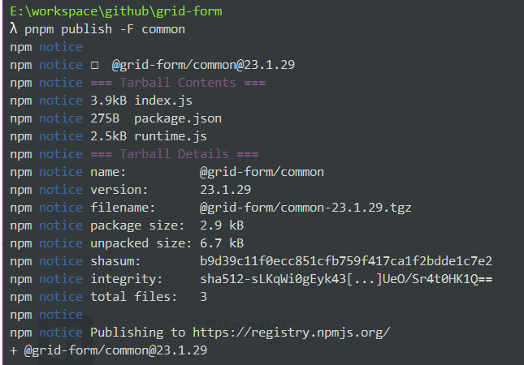

# 开发里程

## 创建项目
> 基于 [pnpm](https://pnpm.io) 搭建 monorepo（单一代码库） 项目

```shell
# 初始化，如没有安装 pnpm 请先执行 npm i -g pnpm
pnpm init

# 安装全局依赖 vue
pnpm install vue -w

# 新建 packages 目录，并创建子目录：common（公共函数）、designer（可视化设计器）、render-naive（基于 naive-ui 的渲染器）
# packages 下的子目录需要存在 package.json 才会被视为包
# 增加 designer、render-* 对公共函数的依赖（为了让依赖实时更新最新版本，使用用通配符更新版本），使用 -F/--filter 进行指定包进行操作
pnpm add common@* -F designer
pnpm add common@* -F render-naive
pnpm add designer@* -F site
```

## 发布组件

```shell
# 发布前需要检查：
# ① npm 的镜像是否为官方地址（https://registry.npmmirror.com/）
# npm config get registry
# 如果不是官方，则通过命令 npm config set registry https://registry.npmmirror.com/
# ② 是否已经设置了用户
# npm adduser
```

注意：npm publish 如果发布带组织名的包，默认为私有的包，而私有的包是要收费的。因此需要在发布的时候增加 --access public

可以在 `package.json`下添加配置

```json
"publishConfig": {
    "access": "public"
}
```



## 参考资料

* [pnpm + monorepo + changeset实现多包管理和发布](https://juejin.cn/post/7181720787400228925)
* [npm publish 那些事](https://www.cnblogs.com/momo798/p/15075312.html)
