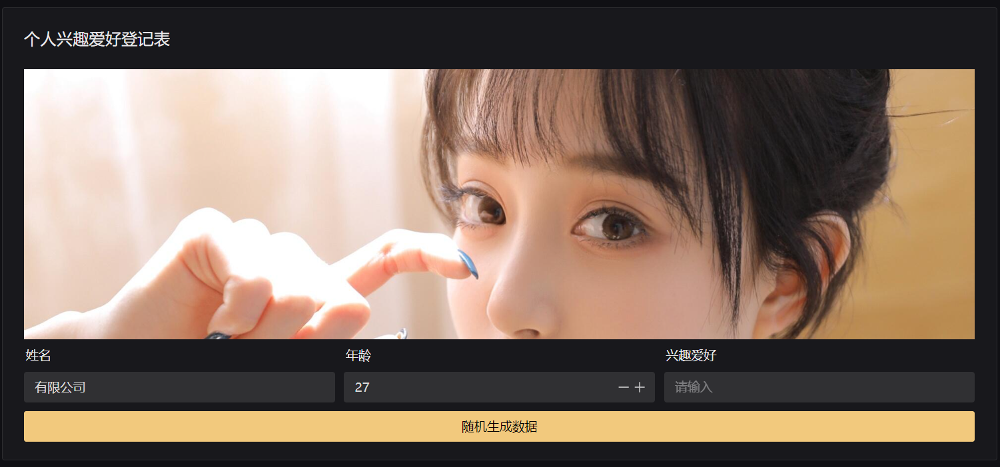

# 演示项目

## 表单源代码及演示

**嵌套表单**

```json
{
    "size": "medium",
    "width": "100%",
    "grid": 1,
    "labelWidth": 120,
    "labelShow": true,
    "labelPlacement": "top",
    "labelAlign": "left",
    "items": [
        {
            "_widget": "ALERT",
            "_col": 1,
            "title": "嵌套表单示例",
            "content": "目前仅支持 Card 容器",
            "_html": false,
            "type": "info",
            "bordered": true,
            "closable": false,
            "_hideLabel": true
        },
        {
            "_widget": "CARD",
            "size": "medium",
            "width": "100%",
            "grid": 3,
            "labelWidth": "120px",
            "labelShow": true,
            "labelPlacement": "top",
            "labelAlign": "left",
            "items": [
                {
                    "_widget": "INPUT",
                    "_uuid": "name",
                    "_text": "姓名",
                    "_col": 1,
                    "disabled": false,
                    "_watch": false,
                    "_required": true,
                    "_regex": "",
                    "_message": "",
                    "placeholder": "请输入",
                    "clearable": false,
                    "show-count": false,
                    "rows": 1,
                    "_value": "",
                    "_active": false
                },
                {
                    "_widget": "INPUT",
                    "_uuid": "address",
                    "_text": "家庭住址",
                    "_col": 1,
                    "disabled": false,
                    "_watch": false,
                    "_required": false,
                    "_regex": "",
                    "_message": "",
                    "placeholder": "请输入",
                    "clearable": false,
                    "show-count": false,
                    "rows": 1,
                    "_value": "",
                    "_active": false
                },
                {
                    "_widget": "RADIO",
                    "_uuid": "sex",
                    "_text": "性别",
                    "_col": 1,
                    "disabled": false,
                    "_watch": false,
                    "_required": false,
                    "_regex": "",
                    "_message": "",
                    "button": false,
                    "options": "0|保密,1|男,2|女",
                    "_value": "0",
                    "_active": false
                }
            ],
            "_col": 1,
            "title": "个人信息登记表",
            "bordered": true,
            "_container": true,
            "_hideLabel": true
        }
    ],
    "submitText": "提交数据",
    "url": "",
    "okText": "",
    "onLoad": "",
    "onSubmit": "",
    "onChange": "",
    "afterSubmit": "",
    "hides": [],
    "buttons": []
}
```

* 图片加自定义按钮
> 2024-01-22



```json
{
    "size": "medium",
    "width": "100%",
    "grid": 1,
    "labelWidth": 120,
    "labelShow": true,
    "labelPlacement": "top",
    "labelAlign": "left",
    "items": [
        {
            "_widget": "CARD",
            "size": "medium",
            "width": "100%",
            "grid": 3,
            "labelWidth": "120px",
            "labelShow": true,
            "labelPlacement": "top",
            "labelAlign": "left",
            "items": [
                {
                    "_widget": "IMAGE",
                    "_col": 3,
                    "height": "auto",
                    "maxHeight": "300px",
                    "full": false,
                    "scriptTrigger": "click",
                    "script": "",
                    "_hideLabel": true,
                    "src": "https://www.freeimg.cn/i/2024/01/22/65ae18507543c.jpg"
                },
                {
                    "_widget": "INPUT",
                    "_uuid": "name",
                    "_text": "姓名",
                    "_col": 1,
                    "disabled": false,
                    "_watch": false,
                    "_required": false,
                    "_regex": "",
                    "_message": "",
                    "placeholder": "请输入",
                    "clearable": false,
                    "show-count": false,
                    "rows": 1,
                    "_value": "",
                    "_active": false
                },
                {
                    "_widget": "NUMBER",
                    "_uuid": "age",
                    "_text": "年龄",
                    "_col": 1,
                    "disabled": false,
                    "_watch": false,
                    "_required": false,
                    "_regex": "",
                    "_message": "",
                    "placeholder": "请输入",
                    "clearable": false,
                    "_active": false
                },
                {
                    "_widget": "INPUT",
                    "_uuid": "love",
                    "_text": "兴趣爱好",
                    "_col": 1,
                    "disabled": false,
                    "_watch": false,
                    "_required": false,
                    "_regex": "",
                    "_message": "",
                    "placeholder": "请输入",
                    "clearable": false,
                    "show-count": false,
                    "rows": 1,
                    "_value": "",
                    "_active": false
                },
                {
                    "_widget": "BUTTON",
                    "_col": 3,
                    "label": "随机生成数据",
                    "text": false,
                    "round": false,
                    "disabled": false,
                    "scriptTrigger": "click",
                    "script": "form.age = Math.floor(Math.random()*30) + 15;\nconsole.debug(form);",
                    "_hideLabel": true,
                    "_active": false,
                    "type": "warning"
                }
            ],
            "_col": 1,
            "title": "个人兴趣爱好登记表",
            "bordered": true,
            "_container": true,
            "_hideLabel": true
        }
    ],
    "submitText": "",
    "url": "",
    "okText": "",
    "onLoad": "",
    "onSubmit": "",
    "onChange": "",
    "afterSubmit": "",
    "hides": [],
    "buttons": []
}
```
